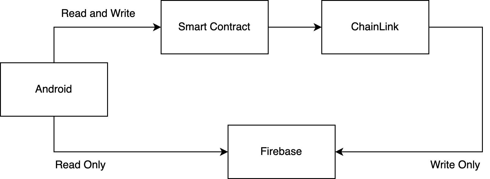

# VoteChain

This project is an application that creates and manages voting using Ethereum smart contracts.

## Architecture

### Smart Contract

The smart contract provides functions such as creating votes, casting votes, and ending votes. To facilitate quick
retrieval on the client side, some data such as the title, content, and creation time of the votes are stored in
Firebase via ChainLink.

[Show More](./contract)

### ChainLink

ChainLink is used to call Firebase from the smart contract. ChainLink executes JavaScript code to call Firebase with the
data received from the smart contract and returns the result.

### Android

The Android application calls the smart contract and Firebase to enable users to participate in voting. For searching
votes, it uses Firebase, while important tasks such as viewing vote statistics and participating in the voting process
are handled by calling the smart contract.

[Show More](./android)

### Firebase

Firebase is used for authentication and quick retrieval of voting data in the application. Firestore does not store
critical information such as voting items and vote counts; it only stores information for search purposes. This design
ensures that meaningful voting data can only be accessed through the smart contract.